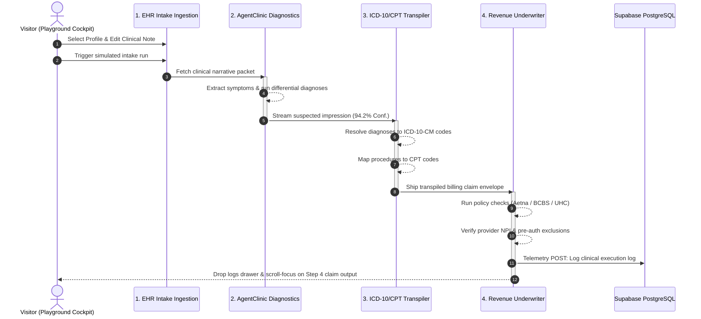

# 🏥 Clinical Systems Architecture // EHR Operational Middleware

[](https://clinical-middleware-dashboard.vercel.app)
[](https://supabase.com)
[](https://github.com/safevoice009/clinical-middleware-dashboard/actions)
[](https://nextjs.org)

An autonomous, metadata-first **Clinical-to-Billing Intercept Middleware Playground** designed to bridge the structural gap between advanced medical AI reasoning agents and legacy healthcare revenue cycles. 

Developed by **Dr. Baddam Sucharith Reddy** (AI-Assisted), this platform acts as an automated "smart guardrail" cockpit, intercepting unstructured clinical notes from LLM reasoning models, predicting impressions, transpiling them to standard **ICD-10-CM / CPT codes**, and checking payer policies in real time.

---

## 🗺️ System Engineering Data Flow

The diagram below details how unstructured Electronic Health Record (EHR) narratives are parsed, validated, and converted into compliant, audited insurance claim envelopes:



---

## 🎨 Creative Interactive Interface (Bento Cockpit)

The deployed web application provides a responsive, sand-toned play sandbox where you can:
- **Edit Narrative Notes**: Under **Step 1**, modify the patient's symptoms or narrative and re-verify how it updates outputs.
- **Inspect Confidence Gauges**: Under **Step 2**, view diagnostic outcomes and watch the circular SVG confidence dial animate.
- **Hover billing Tooltips**: Under **Step 3**, hover over CPT/ICD code badges to view detailed procedural explanations.
- **Underwrite Claims**: Under **Step 4**, review pre-auth checklists and export/copy compile claim JSON structures.
- **Read Developer Telemetry Logs**: Expand or auto-collapse the bottom logs drawer featuring colored, macOS-styled console streams.

---

## 🛠️ The Tech Stack

- **Frontend Core**: [Next.js 16.2.6 (App Router)](https://nextjs.org/) + [React 19.2.4](https://react.dev/) + [TypeScript](https://www.typescriptlang.org/)
- **Typography & Aesthetics**: [Tailwind CSS v4](https://tailwindcss.com/) using **Lora** (Editorial Serif) & **Outfit** (Sans-Serif) Google Fonts.
- **Database & Telemetry**: [Supabase](https://supabase.com/) (PostgreSQL Relational DB)
- **Deployment & Preview**: [Vercel CI/CD Pipeline](https://vercel.com/)

---

## 💾 Database DDL & Schema Setup

The relational telemetry backend uses two tables created inside a free-tier Supabase instance:

```sql
-- Disable Row Level Security (RLS) for public portfolio playground access
ALTER TABLE clinical_pipelines DISABLE ROW LEVEL SECURITY;
ALTER TABLE pipeline_logs DISABLE ROW LEVEL SECURITY;

-- 1. Main clinical pipeline definition table
CREATE TABLE clinical_pipelines (
    id UUID PRIMARY KEY DEFAULT gen_random_uuid(),
    title TEXT NOT NULL,
    description TEXT,
    target_specialty TEXT NOT NULL,
    clinical_repo_source TEXT NOT NULL, -- e.g. 'AgentClinic + MedAgentBench'
    icd10_validation_supported BOOLEAN DEFAULT TRUE,
    completion_estimate_mins INT DEFAULT 5,
    community_trust_score NUMERIC(3,1) DEFAULT 0.0,
    created_at TIMESTAMP WITH TIME ZONE DEFAULT NOW()
);

-- 2. Telemetry logs table
CREATE TABLE pipeline_logs (
    id UUID PRIMARY KEY DEFAULT gen_random_uuid(),
    pipeline_id UUID REFERENCES clinical_pipelines(id) ON DELETE CASCADE,
    step_name TEXT NOT NULL, -- e.g. 'EHR Parse', 'ICD-10 Audit'
    status TEXT NOT NULL,    -- 'Success', 'Warning', 'Contraindication'
    log_payload JSONB,
    created_at TIMESTAMP WITH TIME ZONE DEFAULT NOW()
);

-- Seed a verification record
INSERT INTO clinical_pipelines (title, description, target_specialty, clinical_repo_source, icd10_validation_supported, community_trust_score)
VALUES (
    'Cardiovascular Trial Matching & Validation Engine',
    'Automated clinical trial eligibility matching wrapped with an operational billing guardrail.',
    'Cardiology',
    'AgentClinic + MedAgentBench',
    TRUE,
    9.9
);
```

---

## 🤖 Repository Scraper & Automation Cron

To keep the pipeline metadata synchronized, a scheduled Python scraper run checks GitHub repository statistics and updates community trust scores:
- **Script**: `scraper/medical_scraper.py` (uses built-in `urllib` to make HTTPS calls with zero extra dependencies).
- **Automation Workflow**: `.github/workflows/scraper.yml` (runs every Sunday at midnight UTC).

---

## 📦 Quickstart Setup

1. **Clone & Enter Repo**:
   ```bash
   git clone https://github.com/safevoice009/clinical-middleware-dashboard.git
   cd clinical-middleware-dashboard
   ```

2. **Install Dependencies**:
   ```bash
   npm install
   ```

3. **Configure Database Env**:
   Create a `.env.local` file in the root:
   ```env
   NEXT_PUBLIC_SUPABASE_URL=https://your-supabase-project-id.supabase.co
   NEXT_PUBLIC_SUPABASE_ANON_KEY=your-supabase-anon-publishable-token
   ```

4. **Boot Up Dev Server**:
   ```bash
   npm run dev
   ```
   Open `http://localhost:3000` to interact with the play area.

---

## 🔗 Ecosystem References

This middleware aggregates concepts from these open-source clinical reasoning models:
1. [AgentClinic](https://github.com/W革新者/AgentClinic) - Simulated doctor-patient dialogue pipelines.
2. [MedAgentBench](https://github.com/vinesmsuic/MedAgentBench) - Virtual EHR benchmarking suites.
3. [EHRAgent](https://github.com/textviewer/EHRAgent) - Structured database queries over health charts.

---

## 🎓 Developer & Legal Disclaimer

**Developed by Dr. Baddam Sucharith Reddy (AI-Assisted)**  
*Contact & Portfolios*: [LinkedIn Profile](https://www.linkedin.com/in/sucharith007) | [GitHub Profile](https://github.com/safevoice009)

*Legal Notice: This software is a proof-of-concept prototype. All patient profiles, clinical narratives, medical codes, policy checks, and database logs are strictly simulated and for demonstration purposes. It should not be used as medical advice or in real production healthcare environments.*
